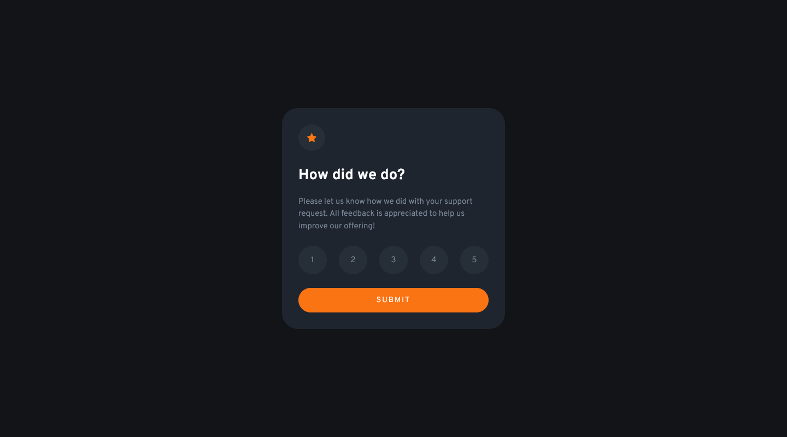
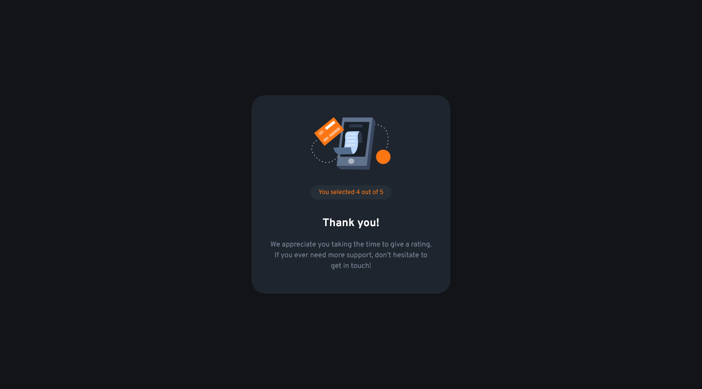
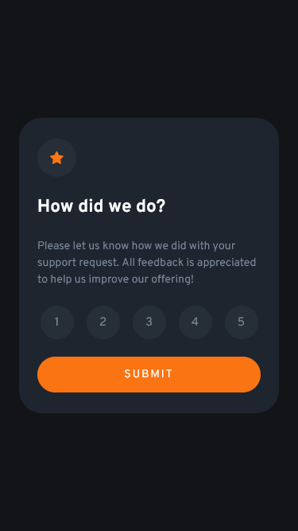
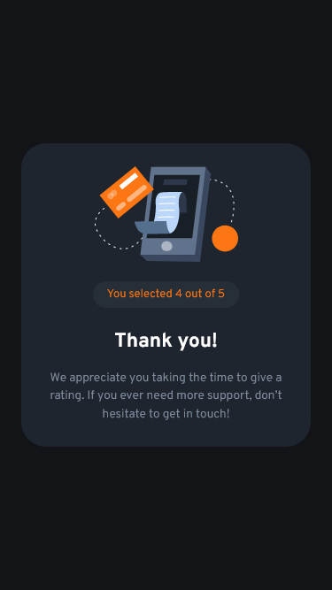

# Frontend Mentor - Interactive rating component solution

This is a solution to the [Interactive rating component challenge on Frontend Mentor](https://www.frontendmentor.io/challenges/interactive-rating-component-koxpeBUmI). Frontend Mentor challenges help you improve your coding skills by building realistic projects. 

## Table of contents

- [Overview](#overview)
  - [The challenge](#the-challenge)
  - [Screenshot](#screenshot)
  - [Links](#links)
- [My process](#my-process)
  - [Built with](#built-with)
- [Author](#author)
- [Acknowledgments](#acknowledgments)

## Overview

### The challenge

Users should be able to:

- View the optimal layout for the app depending on their device's screen size
- See hover states for all interactive elements on the page
- Select and submit a number rating
- See the "Thank you" card state after submitting a rating

### Screenshot

### Desktop View :

### Mobile View

### Links

- Live Site URL: [Interactive Rating Component by Earthyy](https://earthyy-interactive-rating-component.netlify.app/)

## My process

### Built with

- Semantic HTML5 markup
- CSS custom properties
- Flexbox
- CSS Grid
- Mobile-first workflow
- Javascript (Manipulating DOM)

## Author

- Frontend Mentor - [@Earthyyy](https://www.frontendmentor.io/profile/Earthyyy)
- Github - [@Earthyy](https://github.com/Earthyyy)

## Acknowledgments

Big Thanks <3 to :

* [Kevin Powell](https://www.youtube.com/@KevinPowell)
* [Codecademy](https://www.codecademy.com)
* [Frontend Mentor](https://www.frontendmentor.io/) 

